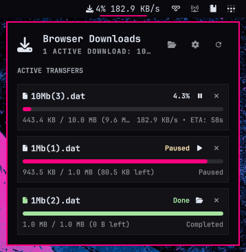

# Downlink — Omarchy Bar Widget

A lightweight, modern, and native [Omarchy](https://omarchy.org/) status bar widget and control panel to track and control active file downloads from **Firefox, Zen Browser, Floorp, LibreWolf, and Gecko-based browsers** in real time.

<p align="center">
  
</p>

---

## Requirements & Prerequisites

Before installing the widget, ensure your system has:

1. **Omarchy Linux** with Quickshell status bar (`omarchy plugin` / `omarchy bar` CLI available).
2. **Gecko-based Browser:** Zen Browser, Firefox, Floorp, LibreWolf, or Waterfox.
3. **Python 3** (standard on Arch / Omarchy).
4. **Nerd Font** (standard on Omarchy, used for status glyphs).

---

## ✨ Features

- **Real-Time Bar Progress:** Displays live percentage, download speed, and ETA on your status bar, switching to a clean green icon upon completion.
- **Two-Way Download Controls:**
  - **Pause & Resume (`⏸` / `▶`):** Freeze and continue active downloads directly from the desktop panel.
  - **Cancel (`✕`):** Cancel in-progress downloads with a single click.
- **Persistent Completed Downloads:** Completed downloads stay in the panel until you dismiss them.
- **One-Click File & Folder Access:** Click **``** on any completed download to launch your file manager and highlight the file.
- **Configurable File Manager:** Choose your preferred file manager (`nautilus`, `strata`, `dolphin`, `thunar`, etc.) directly from the panel.
- **In-Panel Settings:** Toggle widget preferences (hide when idle, speed, percentage, file manager) directly from the panel with a single click.
- **Zero Network Overhead:** Uses direct local stdin/stdout IPC via Mozilla Native Messaging; no open network ports or background HTTP servers.

---

## 🚀 Installation & Setup

### Step 1: Install the Omarchy Plugin (One Command)

Install and enable the widget on your Omarchy status bar using the official CLI:

```bash
omarchy plugin add https://github.com/Rizmi/omarchy-browser-downloads-plugin.git --enable
```

---

### Step 2: Register Native Messaging

Run the one-time local setup script to register the Native Messaging IPC bridge with your browser:

```bash
bash ~/.config/omarchy/plugins/io.github.rizmi.browser-downloads/setup.sh
```

*This securely configures the local communication channel (`~/.mozilla/native-messaging-hosts/`) so the browser can stream download stats to the status bar.*

---

### Step 3: Install the Browser Extension

The companion extension is verified and signed by Mozilla, allowing it to install permanently in your browser profile without warnings or temporary reloads.

#### Option A: Install from Mozilla Add-ons (Recommended)
Install directly into your browser with one click:
👉 **[Install Browser Download Streamer](https://addons.mozilla.org/firefox/addon/browser-download-streamer/)**

#### Option B: Install Manually from Repository
If installing offline or from source:
1. Open your browser (Zen, Firefox, Floorp, or LibreWolf).
2. Drag and drop the extension file into any open browser window:
   ```text
   ~/.config/omarchy/plugins/io.github.rizmi.browser-downloads/extension/browser-download-streamer.xpi
   ```
   *(Or press `Ctrl + O` in the browser and select the `.xpi` file).*
3. When the prompt appears: **"Add Browser Download Streamer?"**, click **Add**.

---

## 🛠️ Manual Installation (For Developers / Source Clone)

If you prefer to install manually from git:

1. Clone the repository into your Omarchy plugins directory:
   ```bash
   git clone https://github.com/Rizmi/omarchy-browser-downloads-plugin.git \
     ~/.config/omarchy/plugins/io.github.rizmi.browser-downloads
   ```

2. Run the setup script to register native messaging:
   ```bash
   bash ~/.config/omarchy/plugins/io.github.rizmi.browser-downloads/setup.sh
   ```

3. Validate and enable the plugin:
   ```bash
   omarchy plugin validate ~/.config/omarchy/plugins/io.github.rizmi.browser-downloads
   omarchy plugin enable io.github.rizmi.browser-downloads --section right
   ```

4. Reload the shell if necessary:
   ```bash
   omarchy restart shell
   ```

---

## 🗑️ Removal & Uninstalling

### Option 1: Using `omarchy plugin`

```bash
omarchy plugin remove io.github.rizmi.browser-downloads
omarchy restart shell
```

### Option 2: Manual Removal

```bash
omarchy plugin disable io.github.rizmi.browser-downloads
rm -rf ~/.config/omarchy/plugins/io.github.rizmi.browser-downloads
omarchy restart shell
```

### Removing the Browser Extension:
In Zen or Firefox, navigate to `about:addons`, find **Browser Download Streamer**, click the three dots (`...`), and select **Remove**.

---

## ⚙️ In-Panel Settings & Configuration

You can customize the widget directly inside the **Omarchy panel by clicking the ⚙ gear button** (or pressing `S`), without touching the terminal! Changes are automatically saved to `~/.config/omarchy/shell.json`.

Alternatively, configure options manually in `~/.config/omarchy/shell.json`:

```json
{
  "id": "io.github.rizmi.browser-downloads",
  "hideWhenIdle": false,
  "showSpeed": true,
  "showPercent": true,
  "fileManagerCommand": "nautilus",
  "downloadsFolder": ""
}
```

### Options:

| Setting | Type | Default | Description |
| :--- | :--- | :--- | :--- |
| `hideWhenIdle` | `boolean` | `false` | When `true`, hides the widget from the bar unless a download is actively running or completed. |
| `showSpeed` | `boolean` | `true` | Show download speed (e.g. `1.5 MB/s`) directly on the bar. |
| `showPercent` | `boolean` | `true` | Show percentage (e.g. `45%`) directly on the bar. |
| `fileManagerCommand` | `string` | `nautilus` | Command to open folders and files (e.g. `nautilus`, `strata`, `dolphin`, `thunar`, `xdg-open`). |
| `downloadsFolder` | `string` | `""` | Custom downloads folder path (leave empty for default `~/Downloads`). |

---

## ⌨️ Controls & Shortcuts

| Action | Control |
| :--- | :--- |
| **Toggle Panel** | Left Click on bar widget |
| **Open Downloads Folder** | Right Click on bar widget |
| **Pause / Resume Download** | Click `⏸` or `▶` button on download card |
| **Cancel Download** | Click `✕` button on in-progress card |
| **Open File in Folder** | Click `` button on completed card |
| **Dismiss / Clear Download** | Click `✕` button on completed card |
| **Toggle Settings View** | Click ⚙ Gear icon in header (or press `S`) |
| **Open Downloads Folder** | `O` key while panel is focused |
| **Open Browser Library** | `Z` key while panel is focused |
| **Refresh Status** | `R` key while panel is focused |
| **Close Panel** | `Esc` key |

---

## 🔍 Standalone CLI Monitor

A terminal monitor is included for watching download streams from the command line:

```bash
python3 ~/.config/omarchy/plugins/io.github.rizmi.browser-downloads/cli-monitor.py -w
```

---

## 📄 License

MIT. See [LICENSE](LICENSE). Copyright (c) 2026 Omarchy Community.
